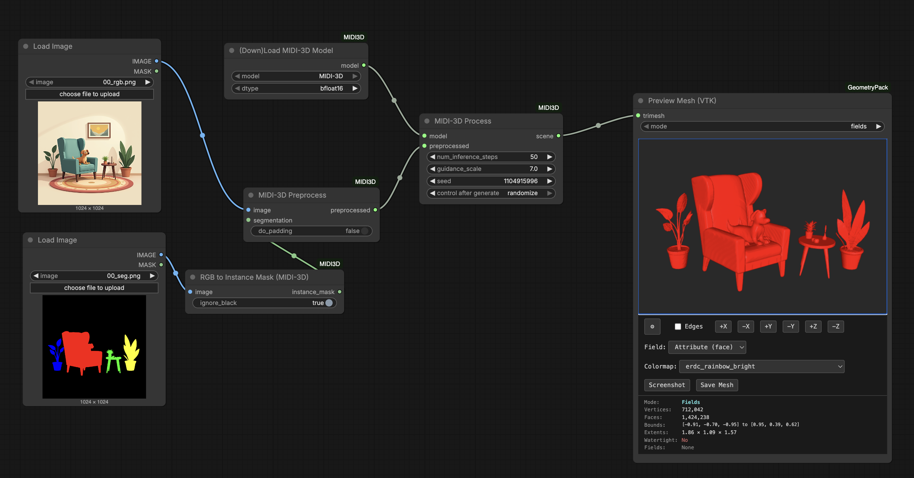

# ComfyUI-MIDI3D

ComfyUI nodes for [MIDI-3D](https://github.com/MIDI-3D/MIDI-3D) multi-instance 3D scene generation.

MIDI-3D generates compositional 3D scenes from a single image with instance segmentation, handling multiple objects simultaneously using multi-instance diffusion.



## Features

- **Multi-Instance Generation**: Generate multiple 3D objects from a single segmented image
- **Compositional Scenes**: Automatically compose objects into a coherent 3D scene
- **Texture Support**: Apply multi-view consistent textures using MV-Adapter
- **ComfyUI Integration**: Seamless integration with ComfyUI's node-based workflow
- **GeometryPack Compatible**: Outputs Scene objects compatible with mesh processing nodes

## Installation

1. Clone this repository into your ComfyUI custom nodes directory:
```bash
cd ComfyUI/custom_nodes
git clone https://github.com/YOUR_USERNAME/ComfyUI-MIDI3D.git
```

2. Install dependencies:
```bash
cd ComfyUI-MIDI3D
pip install -r requirements.txt
```

3. Restart ComfyUI

## Nodes

### Core Nodes

- **Load MIDI-3D Model**: Download and load the MIDI-3D diffusion pipeline
- **MIDI-3D Preprocess**: Prepare RGB image and segmentation mask from ComfyUI tensors
- **MIDI-3D Preprocess (Files)**: Load and prepare images from file paths
- **MIDI-3D Process**: Run multi-instance diffusion to generate 3D scene

### Texture Nodes

- **Load Texture Models**: Load MV-Adapter and texture projection models
- **MIDI-3D Texture**: Apply multi-view consistent textures to generated meshes

### Utility Nodes

- **Scene to Trimesh**: Convert multi-mesh Scene to single merged Trimesh for export
- **Create Instance Mask**: Generate instance segmentation from color-coded mask
- **Split Mask by Color**: Split segmentation mask into individual instances

## Usage

1. **Prepare Input**:
   - Load or create an RGB image
   - Create an instance segmentation mask (color-coded, each object a different color)

2. **Preprocess**:
   - Use `MIDI-3D Preprocess` to prepare the images for processing
   - The node handles padding and normalization automatically

3. **Generate 3D Scene**:
   - Load the model with `Load MIDI-3D Model`
   - Run `MIDI-3D Process` to generate the 3D scene
   - Output is a Scene object containing individual meshes

4. **Optional - Add Textures**:
   - Load texture models with `Load Texture Models`
   - Apply textures with `MIDI-3D Texture`

5. **Export**:
   - Use `Scene to Trimesh` to merge objects into a single mesh
   - Connect to mesh export nodes (e.g., from GeometryPack)

## Requirements

- PyTorch with CUDA support
- diffusers
- transformers
- trimesh
- scikit-image
- open3d-cpu
- mvadapter
- pymeshlab
- jaxtyping

See `requirements.txt` for complete dependencies.

## Credits

- **MIDI-3D**: [Official Repository](https://github.com/MIDI-3D/MIDI-3D)
- **MV-Adapter**: [Hugging Face](https://huggingface.co/huanngzh/mv-adapter)
- **ComfyUI**: [Official Repository](https://github.com/comfyanonymous/ComfyUI)

## License

See LICENSE file for details.
